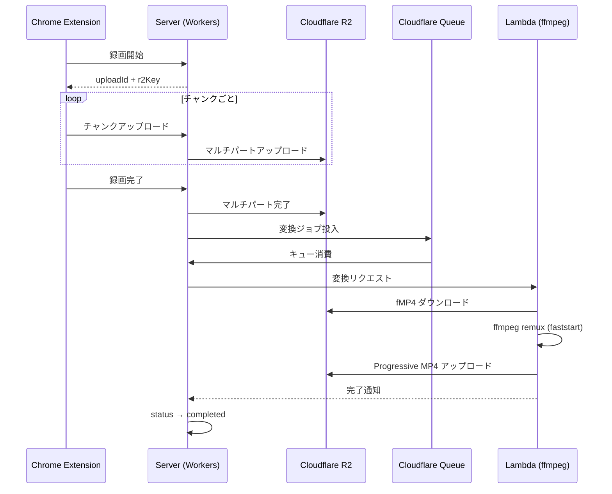

# Torea

ブラウザタブの画面録画・共有プラットフォーム。Chrome 拡張機能でタブの映像・音声（マイク含む）をキャプチャし、R2 へリアルタイムにマルチパートアップロード。Web ダッシュボードで録画の再生・管理・共有ができる。

## 主な機能

- **タブ録画** — Chrome 拡張から 1 クリックで録画開始（カウントダウン＋録画中インジケーター付き）
- **リアルタイムアップロード** — 録画中に R2 へチャンクごとにマルチパートアップロード
- **オーディオミキシング** — タブ音声 + マイク音声を Web Audio API で合成
- **動画変換** — AWS Lambda + ffmpeg で fMP4 → Progressive MP4 に remux（`-movflags +faststart`）
- **共有リンク** — トークンベースの公開共有（パスワード保護・組織メンバー限定に対応）
- **oEmbed** — 共有リンクの oEmbed メタデータ提供
- **コメント** — 録画へのスレッド型タイムスタンプ付きコメント
- **Webhook** — 録画/文字起こしイベントを外部サーバーに HMAC-SHA256 署名付き配信。Cloudflare Queue + 指数バックオフで再送、連続失敗時に自動無効化。受信側ガイドは [docs/webhooks.md](./docs/webhooks.md)
- **閲覧分析** — 録画ごとの閲覧イベント（地理情報・デバイス情報）を記録
- **組織・チーム** — マルチテナント対応、メンバー招待、RBAC（owner / admin / member）
- **一括操作** — 録画の一括削除

## 技術スタック

| レイヤー | 技術 |
| --- | --- |
| モノレポ | pnpm 10 workspaces + Turborepo |
| Web | Next.js 16, React 19, Tailwind CSS 4, media-chrome |
| API | Hono（Cloudflare Workers）, Cloudflare Queue |
| Chrome 拡張 | WXT（Manifest V3）, React, Offscreen Document + MediaRecorder |
| DB | Cloudflare D1（SQLite）+ Drizzle ORM |
| ストレージ | Cloudflare R2（マルチパートアップロード） |
| KV | Cloudflare KV（キャッシュ・共有トークン） |
| 認証 | better-auth（組織プラグイン, PBKDF2-SHA256） |
| メール | Resend |
| 動画変換 | AWS Lambda + ffmpeg（Docker / Node.js 24 Alpine） |
| インフラ | Alchemy（Cloudflare Workers, D1, R2, KV, Queue） |
| UI | shadcn/ui, Lucide Icons, Recharts |
| Lint / Format | Biome, knip, dependency-cruiser |
| CI/CD | GitHub Actions（lint → type-check → build → deploy） |

## プロジェクト構成

```txt
apps/
  extension/       Chrome 拡張機能（WXT + React）
    entrypoints/     Service Worker, Popup, Content Scripts, Offscreen Recorder
    lib/             Auth client, Storage, API helpers
    utils/           AudioMixer, MultipartUploadManager
  server/          Hono API サーバー（Cloudflare Workers）
    src/routes/      API エンドポイント（auth, recordings, shares, comments, organizations）
    src/use-cases/   ビジネスロジック（RecordingService, ShareService, ViewAnalyticsService）
    src/infrastructure/  リポジトリ層 + R2StorageClient
    src/domain/      ドメイン型 + DomainError
    src/middleware/   認証・RBAC
  web/             Next.js ダッシュボード（@opennextjs/cloudflare でデプロイ）
    src/app/         App Router（dashboard, auth, embed）

packages/
  auth/            better-auth 設定・権限定義・メールテンプレート
  db/              Drizzle スキーマ・マイグレーション（users, recordings, share-links, comments, view-events）
  env/             環境変数バリデーション（@t3-oss/env-nextjs）
  infra/           Alchemy インフラ定義（alchemy.run.ts）
  shared/          Zod スキーマ・日付ユーティリティ
  ui/              共有 UI コンポーネント（shadcn/ui ベース）

lambdas/
  video-processor/ AWS Lambda — fMP4→Progressive MP4 変換（ffmpeg, Hono, S3 SDK）
```

## 録画〜変換フロー



## Lambda Video Processor

`lambdas/video-processor/` — R2 上の fMP4 を Progressive MP4 に remux する AWS Lambda 関数。

- **ランタイム**: Node.js 24 Alpine + ffmpeg + AWS Lambda Web Adapter
- **エンドポイント**: `POST /process` — `{ r2Key }` を受け取り、R2 からダウンロード → `ffmpeg -c copy -movflags +faststart` → R2 へ上書きアップロード
- **デプロイ**: Docker イメージを ECR にプッシュし Lambda にデプロイ
- **トリガー**: Cloudflare Queue → Server の queue consumer が Lambda Function URL を呼び出し
